# Word Crush Mobil Oyunu 🎮

Bu proje, **Kocaeli Üniversitesi Bilgisayar Mühendisliği** Yazılım Laboratuvarı-II dersi kapsamında geliştirilmiş, Kotlin tabanlı bir mobil kelime oyunudur. Oyuncuların iki boyutlu bir grid üzerinde harfleri birleştirerek anlamlı kelimeler üretmesini ve stratejik hamlelerle en yüksek puanı toplamasını hedefler.

## 🚀 Projenin Amacı
* Mobil programlama tekniklerini kullanarak etkileşimli bir oyun deneyimi sunmak.
* Dinamik veri yapıları ve yerçekimi algoritmaları gibi oyun mekaniklerini uygulamak.
* Kullanıcıların dil becerilerini ve stratejik düşünme yeteneklerini geliştiren öğretici bir platform oluşturmak.

## 🛠️ Teknik Özellikler
* **Dil:** Kotlin
* **Platform:** Android
* **Harf Üretimi:** Türkçe harf frekansına uygun (%70 sık, %25 orta, %5 nadir harf) olasılık tabanlı algoritma.
* **Kelime Doğrulama:** Sözlük tabanlı kontrol sistemi.

## 🕹️ Oyun Mekanikleri
* **Dinamik Grid:** 6x6, 8x8 ve 10x10 boyut seçenekleri.
* **Hamle Sistemi:** Zorluk seviyesine göre sınırlı hamle sayısı.
* **8 Yönlü Hareket:** Harfleri dikey, yatay ve çapraz olarak birleştirebilme.
* **Yerçekimi Algoritması:** Patlatılan kelimelerin yerine üstteki harflerin düşmesi.

## ✨ Özel Güçler ve Jokerler
Kelime uzunluğuna bağlı olarak oluşan simgeler:
* **4 Harf:** Satır Temizleme
* **5 Harf:** Alan Patlatma (Bomba)
* **6 Harf:** Sütun Temizleme
* **7+ Harf:** Mega Patlatma

## 👥 Geliştiriciler
* **Merve Kübra ÖZTÜRK**
* **İclal ÜSTÜN**

## 📸 Ekran Görüntüleri

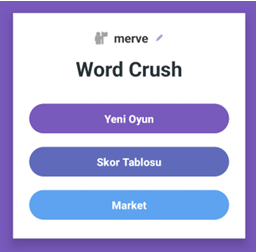 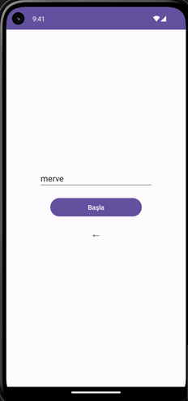 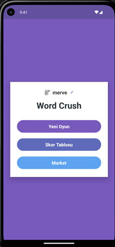 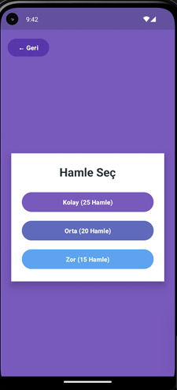 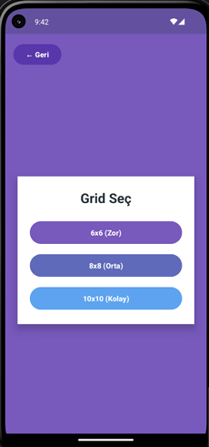 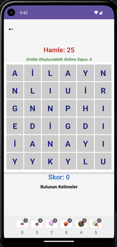
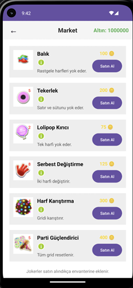 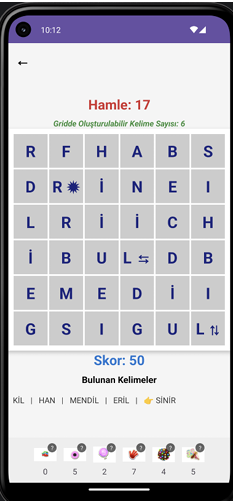 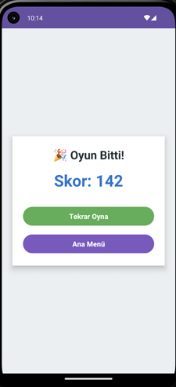 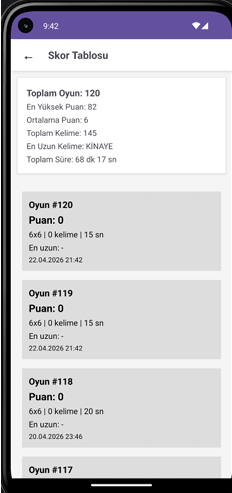 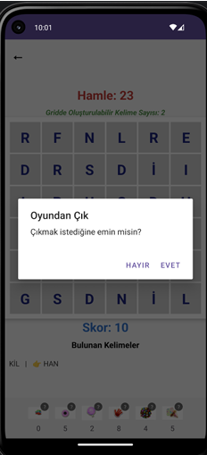
